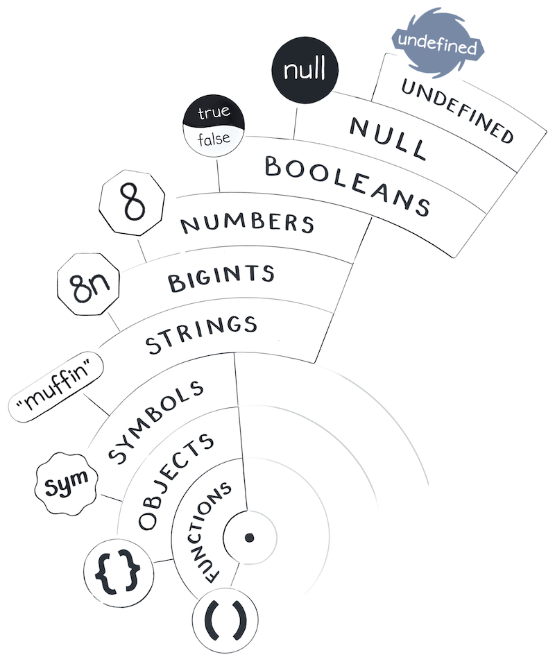

<!-- .slide: id="lesson1" -->

# Redi React Course

### Fall 2020

<br>

##### Class 1 - 24.08.2020

---

### Welcome to React!

---

### Agenda

- [1. Introduction](#lesson1:intro) ([Exercises](#lesson1:intro:exercises))
- [2. JS-Refresh - Part 1](#lesson1:js-refresh) ([Exercises](#lesson1:js-refresh:exercises))

[Jump to Homework](#lesson1:homework)

---

<!-- .slide: id="lesson1:intro" -->

# 1. Introduction

---

### What is it React?

- A library/framwework to build complex web applications
- ...

---

### Real World React examples

-

---

### Why should you choose React?

-

---

### React Alternatives

- Vue.js
- Angular
- Svelte (?)

---

### Understanding Single Page Applications (SPAs) and multi-page applications

-

---

<!-- .slide: id="lesson1:intro:exercises" -->

### Exercises

...

---

<!-- .slide: id="lesson1:js-refresh" -->
<!-- .slide: style="font-size:80%;" -->

# 2. Refreshing JavaScript & Key ES2015+ Features

- React builds heavily on ES2015+ features
- ES2015 refers to the new version of JS released in 2015
- Since 2015, a new version is released every year
- Changes always extend, never change JS - because it would break the web

---

<!-- .slide: style="font-size:60%;" -->

## JavaScript Versions

| Edition | Date published | Name                     |
| ------- | -------------- | ------------------------ |
| 1       | June 1997      |                          |
| 2       | June 1998      |                          |
| 3       | December 1999  |                          |
| 4       | Abandoned      |                          |
| 5       | December 2009  |                          |
| 5.1     | June 2011      |                          |
| 6       | June 2015      | ECMAScript 2015 (ES2015) |
| 7       | June 2016      | ECMAScript 2016 (ES2016) |
| 8       | June 2017      | ECMAScript 2017 (ES2017) |
| 9       | June 2018      | ECMAScript 2018 (ES2018) |
| 10      | June 2019      | ECMAScript 2019 (ES2019) |
| 11      | June 2020      | ECMAScript 2020 (ES2020) |

Note: Highlight, how JS is now on a yearly schedule since 2015

---

### Table of contents

- [Datatypes](#lesson1:js-refresh:datatypes)
- [`var` / `let` / `const`](#lesson1:js-refresh:var-let-const)
- [Arrow Functions](#lesson1:js-refresh:arrow-fns)
- [Spread & Rest Operators](#lesson1:js-refresh:spread-rest)
- [Destructuring](#lesson1:js-refresh:destructuring)
- [JavaScript Fundamentals Resources](#lesson1:js-refresh:resources)

---

<!-- .slide: id="lesson1:js-refresh:datatypes" -->
<!-- .slide: style="font-size:60%;" -->

### Datatypes

JS has the following datatypes (in a nutshell)

* Primitive Datatypes
  * undefined: Variable that has not been assigned a value
  * null: signals the non-existence of a value
  * Boolean: `true` or `false`
  * Number: between -(253 − 1) and 253 − 1 & `+Infinity`/`-Infinity`/`NaN`
  * String: textual data
  * BigInt*: Like number but without the limitations
  * Symbol*: a unique and immutable primitive value

* Object Type(s)
  * **Data Structures** created with `new` (Object, Array, Map, Set, Date, ...)
  * Object: `typeof instance === "object"`
  * Array: `typeof instance === "object"`

* Function : `typeof instance === "function"`

---

<!-- .slide: class="center" -->

### Datatypes

_<!-- .element style="text-align: center; font-size:0 "-->
 <!-- .element height="40%" width="40%"-->

Source: justjavascript.com <!-- .element style="text-align: center; font-size:0.5em"-->

Note: Tell everyone to go sign up to justjavascript.com now!

---

<!-- .slide: id="lesson1:js-refresh:var-let-const" -->

### `var`/`let`/`const`

- `let` and `const` basically replace `var`.

  - `let` and `const` are block-scoped. They are not available within the whole execution context like `var`.
  - `let` and `const` can not be redclared. `var` can be redeclared.
  - You use `const` instead of `var` if you plan on never re-assigning this "variable" (effectively turning it into a constant).
  - You use `let` instead of `var` otherwise.

- This is a popular, but definitely opinionated view on `var`/`let`/`const`!

---

### `var`/`let`/`const` - Variable Scope

<small>`var` is available outside a block it is declared within.</small>

```js
{
  var classicVar = "Hey!";
}
console.log(classicVar);
// ✅ Prints "Hey!"
```

<small>`let` & `const` are only accessible within the block they were declared in.</small>

```js
{
  let newLet = "Hey!";
}
console.log(newLet);
// ❌ Throws error: "newLet is undefined"
```

```js
{
  const newConst = "Hey!";
}
console.log(newConst);
// ❌ Throws error: "newConst is undefined"
```

---

### `var`/`let`/`const` - Redeclaring

<small>`var` allows redeclaration of variables</small>

```js
var newVar = "Hey!";
var newVar = "Heyhey!";
// ✅ Works
```

<small>`let` & `const` do not allow redeclaration of variables</small>

```js
let newLet = "Hey!";
let newLet = "Heyhey!";
// ❌ Throws error: "redeclaration of let newLet"
```

```js
const newConst = "Hey!";
const newConst = "Heyhey!";
// ❌ Throws error: "redeclaration of const newConst"
```

---

### `var`/`let`/`const` - Reassignment

<small>`var` & `let` allow reassignment</small>

```js
var newVar = "Hey!";
newVar = "Heyhey!";
// ✅ Works
```

```js
let newLet = "Hey!";
newLet = "Heyhey!";
// ✅ Works
```

<small>`const` does not allow reassignment</small>

```js
const newConst = "Hey!";
newConst = "Heyhey!";
// ❌ Throws error: "invalid assignment to const 'newConst'"
```

---

<!-- .slide: style="font-size:80%" -->

### `const` - Primitive Values vs. Objects

- `const` prevents the reassignment of a variable
- ✅ This works when `const`-variables hold [primitive values](https://developer.mozilla.org/en-US/docs/Glossary/Primitive), because they are immutable
  - string, number, bigint, boolean, undefined, & symbol
- ❌ This does not always work when `const`-variables hold objects, arrays or functions (they are all objects - also arrays and functions!)
  - Objects are stored in variables as references. When changes are made to the object, its reference remains **unchanged**. `const` **will not** block this.
  - When an object is replaced with a completely new object, the reference is changed. `const` **will block** this.

---

### `const` with Objects

<small>Changing a primitive value is blocked by `const`</small>

```js
const newConst = "Hey!";
newConst = "Heyhey!";
// ❌ Throws error: "invalid assignment to const 'newConst'"
```

<small>Changing an object is not blocked by `const`</small>

```js
const newConst = { firstName: "John", lastName: "Doe" };
newConst.firstName = "Max";
// ✅ Works
```

<small>Replacing an object is blocked by `const` (because it is a reassignment)</small>

```js
const newConst = { firstName: "John", lastName: "Doe" };
newConst = { firstName: "Max", lastName: "Doe" };
// ❌ Throws error: "invalid assignment to const 'newConst'"
```

---

<!-- .slide: style="font-size:80%;" -->

### `var`/`let`/`const` - Semantic Perspective

- The way you declare variables can also serve as a form of communcation to other developers looking at code you wrote
  <small>
- From [the article "JavaScript ES6+: var, let, or const?"](https://medium.com/javascript-scene/javascript-es6-var-let-or-const-ba58b8dcde75):

  > - `const` is a signal that the identifier won’t be reassigned.
  > - `let` is a signal that the variable may be reassigned, such as a counter in a loop, or a value swap in an algorithm. It also signals that the variable will be used only in the block it’s defined in, which is not always the entire containing function.
  > - `var` is now the weakest signal available when you define a variable in JavaScript. The variable may or may not be reassigned, and the variable may or may not be used for an entire function, or just for the purpose of a block or loop.

</small>

---

### `var`/`let`/`const` - Summary

- There are subtle, but essential differences between the classic `var` and the new `let` & `const`
- They help us to avoid **creating** bugs while we write code - because we immediately get errors
- We recommend:
  - Always use `const`
  - If you need to reassign, switch to `let`

Note: Opinionated, but simple and easy to remember.

---

### `var`/`let`/`const` - Ressources

- MDN-Documentation: [var](https://developer.mozilla.org/en-US/docs/Web/JavaScript/Reference/Statements/var), [let](https://developer.mozilla.org/en-US/docs/Web/JavaScript/Reference/Statements/let), [const](https://developer.mozilla.org/en-US/docs/Web/JavaScript/Reference/Statements/const)
- Articles: [1](https://codeburst.io/difference-between-var-let-and-const-in-javascript-fbce2fba7b4), [2](https://medium.com/javascript-scene/javascript-es6-var-let-or-const-ba58b8dcde75)

---

<!-- .slide: id="lesson1:js-refresh:arrow-fns" -->

### Arrow Functions

---

<!-- .slide: id="lesson1:js-refresh:spread-rest" -->

### Spread & Rest Operators

---

<!-- .slide: id="lesson1:js-refresh:destructuring" -->

### Destructuring

---

<!-- .slide: id="lesson1:js-refresh:resources" -->

### JavaScript Fundamentals Resources

* https://justjavascript.com/

---

<!-- .slide: id="lesson1:homework" -->

## Homework